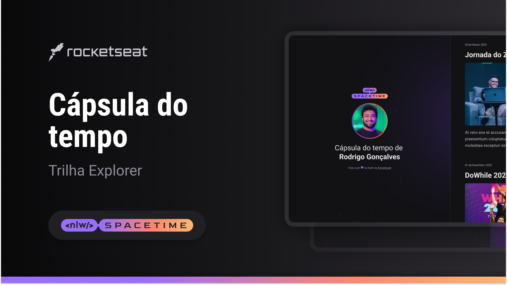

## 🖥️ Projeto

Esse é um projeto Web Responsivo de uma cápsula do tempo para exibir memórias em uma timeline

## 🚀 Tecnologias

Esse projeto foi desenvolvido durante o NLW da Rocketseat com as seguintes tecnologias:

- HTML
- CSS
- Git e Github

## 🏷️ Layout

Você pode visualizar o layout do projeto através
[desse link](https://www.figma.com/file/YrVZcLZA0ZYTrDOnpfEUlZ/my-capsule?type=design&node-id=306%3A84&t=IHcqjJKzTyVaUhV5-1).
É necessário ter uma conta no [Figma](https://www.figma.com)
